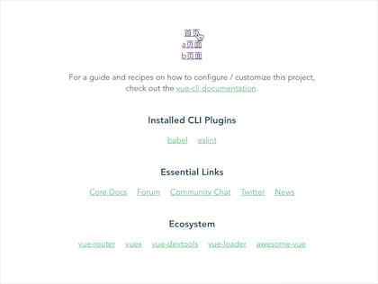
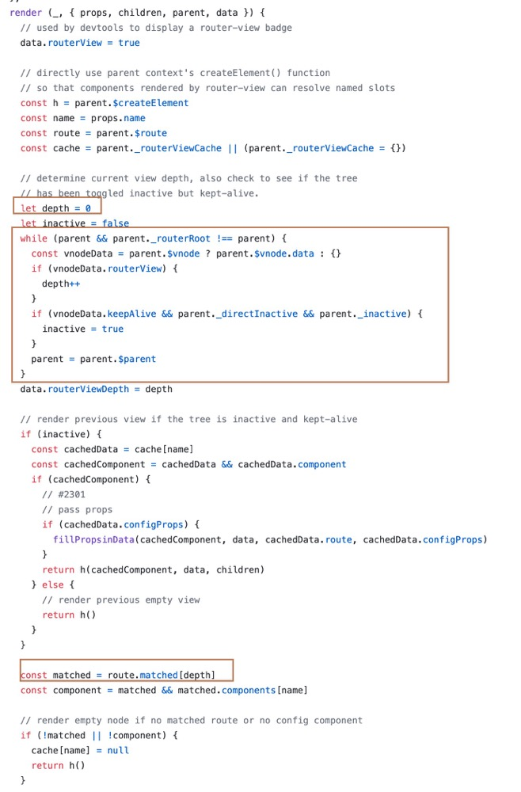
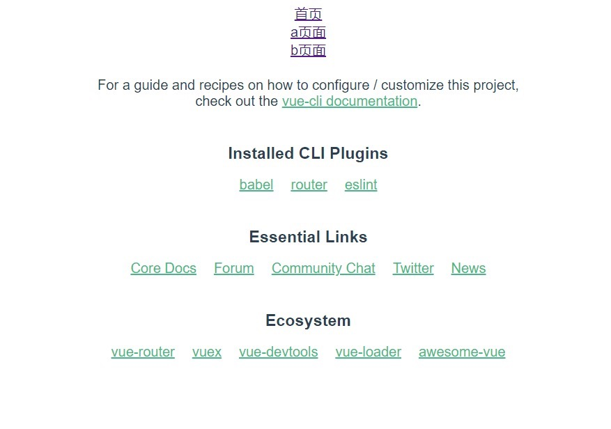

## 1、前言

本篇文章循序渐进带大家实现 VueRouter 的实现原理，阅读前需要对 vue 的使用有基本的认识，学习过 class 了解其基本概念。

实现注意点:

- 如何注册插件
- 实现 router-view 和 router-link 两个组件
- 如何根据当前路由显示对应组件
- 路由切换时如何更新组件
- 嵌套路由如何实现

带着这些问题下面我们就开始一步一步的实现

### 最终代码链接

[github 链接](https://github.com/Layouwen/vue-router-study)

## 2、准备测试数据

我们可以使用 VueCli 搭建一个 VueRouter 的项目。这里简单的说一下命令

```bash
# 如果你使用 yarn
yarn global add @vue/cll
# 如果你使用 npm
npm install -g @vue/cli
# 创建 Vue2 项目
vue create vue-router-study
```

安装完后，直接启动该服务

```bash
cd vue-router-study
yarn serve
```

接着我们可以先使用官方的 **vue-router** 先跑一个测试例子

```bash
yarn add vue-router
```

编写文件 router/index.js

```js
import Vue from 'vue'
import VueRouter from 'vue-router'

Vue.use(VueRouter)

export default new VueRouter({
  routes: [
    {
      path: '/',
      component: () => import('../components/HelloWorld.vue'),
    },
    {
      path: '/a',
      component: () => import('../components/A.vue'),
      children: [{ path: '/a/b', component: () => import('../components/B.vue') }],
    },
  ],
})
```

编辑 **main.js** 将 **router** 添加到 Vue 选项中

```js
import router from './router'

// ...

new Vue({
  router,
  render: h => h(App),
}).$mount('#app')
```

在 **App.vue** 中显示我们的数据

```html
<template>
  <div id="app">
    <div>
      <router-link to="/">首页</router-link>
    </div>
    <div>
      <router-link to="/a">a页面</router-link>
    </div>
    <div>
      <router-link to="/a/b">b页面</router-link>
    </div>
    <router-view></router-view>
  </div>
</template>

// ...
```

创建两个组件 **A.vue** 和 **B.vue**

components/A.vue

```html
<template>
  <div>
    我是A组件
    <div>
      <router-view></router-view>
    </div>
  </div>
</template>

<script>
  export default {
    name: 'A',
  }
</script>
```

componets/B.vue

```html
<template>
  <div>
    我是B页面
  </div>
</template>

<script>
  export default {
    name: 'B',
  }
</script>
```

现在回到页面看看效果



下面我就开始实现自己的 **vue-router** 插件

## 3、实现插件注册

我们使用 **VueRouter** 的时候是通过 use 进行注册，说明 **VueRouter** 是一个插件。需要实现一个 install 方法

创建一个新文件实现我们自己的 VueRouter

创建一个 VueRouter 类，以及编写一个 install 方法，并定义一个变量保存 Vue

src/avue-router.js

```js
let Vue

class VueRouter {}

VueRouter.install = function(_Vue) {
  Vue = _Vue
  Vue.mixin({
    beforeCreate() {
      if (this.$options.router) Vue.prototype.$router = this.$options.router
    },
  })
}

export default VueRouter
```

在 router/index.js 使用我们自己的 **avue-router.js**

```js
// import VueRouter from 'vue-router'
import VueRouter from '../avue-router'
```

回到页面，看看是否正常显示。如果显示成功了，证明插件成功注册

> 在 Vue.use(VueRouter) 时，Vue 会自动调用 install 方案。
> 使用 mixin，将我们在 Vue 选项中的 router 实例，挂载到原型上
> 我们就可以在 Vue 实例中，通过 this.\$router 获得实例数据

## 4、实现 router-link 组件

通过 Vue 挂载全局组件，并将 props 拼接到 href 中，将默认插槽的值填充进去

```js
VueRouter.install = function(_Vue) {
  // ...

  Vue.component('router-link', {
    props: {
      to: {
        type: String,
        require: true,
      },
    },
    render(h) {
      return h(
        'a',
        {
          attrs: {
            href: '#' + this.to,
          },
        },
        this.$slots.default
      )
    },
  })
}
```

现在回到页面，router-link 已经正常显示。

## 5、实现 router-view 组件

需要声明一个响应式的变量 current 保存当前的 hash 路径。router-view 组件根据这个路径匹配 routes 表中对应的组件，显示出来。并监听 hashchange 在路径更新的时候，更新 current 的路径。

```js
// ...

class VueRouter {
  constructor(options) {
    // 保存实例时候配置项
    this.$options = options
    Vue.util.defineReactive(this, 'current', window.location.hash.slice(1) || '/')
    addEventListener('hashchange', this.onHashChange.bind(this))
    addEventListener('load', this.onHashChange.bind(this))
  }
  onHashChange() {
    this.current = window.location.hash.slice(1) || '/'
  }
}

VueRouter.install = function(_Vue) {
  // ...

  Vue.component('router-view', {
    render(h) {
      let component = null
      const route = this.$router.$options.routes.filter(route => route.path === this.$router.current)[0]
      if (route) component = route.component
      return h(component)
    },
  })
}
```

因为此刻我们没有实现嵌套路由，所以需要先把 `A.vue` 中的 `router-view` 注释掉，否则会造成死循环

components/A.vue

```html
<template>
  <div>
    我是A组件
    <div>
      <!-- <router-view></router-view> -->
    </div>
  </div>
</template>

<script>
  export default {
    name: 'A',
  }
</script>
```

现在回到页面，我们发现可以使用 `router-link` 切换页面了。

### 5.1 实现嵌套路由

我们参考一下官方的写法
[https://github.com/vuejs/vue-router/blob/dev/src/components/view.js](https://github.com/vuejs/vue-router/blob/dev/src/components/view.js)



可以看出，他给每个 router-view 组件定义了个 depth 的变量确定它的深度，并且有个 `matched` 数组，记录当前路径的对应路由数组。

比如我们现在的 hash 地址为 `/a/b` 那 `matched` 应该为

```js
let matched = [
  {
    path: '/a',
    component: () => import('../components/A.vue'),
    children: [{ path: '/a/b', component: () => import('../components/B.vue') }],
  },
  {
    path: '/a/b',
    component: () => import('../components/B.vue'),
  },
]
```

现在我们在 `VueRouter` 类中实现 `matched` 方法。通过递归 route 表。收集当前路径的所有 route 数组。

```js
class VueRouter {
  // ...

  match(routes) {
    routes = routes || this.$options.routes
    for (const route of routes) {
      // 如果为根目录，push 一个 route 进去后，直接返回
      if (route.path === '/' && this.current === '/') {
        this.matched.push(route)
        return
      }
      // 如果不为根目录，则判断当前 current 所包含的所有 route，并收集起来
      if (route.path !== '/' && this.current.indexOf(route.path) !== -1) {
        this.matched.push(route)
        if (route.children) this.match(route.children)
      }
    }
  }
}
```

接着我们要改写 `route-view` 组件。在每个 `route-view` 组件中添加 `routerView` 的属性，以此判断是否为 `router-view` 组件。从当前实例出发，向上循环，计算出当前组件，是在第几层。保存该值到 `depth` 变量中。然后再根据 `matched` 表选择对应层数的 `route` 获取该表的 `component` 显示即可。

```js
VueRouter.install = function(_Vue) {
  // ...

  Vue.component('router-view', {
    render(h) {
      this.$vnode.data.routerView = true
      let depth = 0
      let parent = this.$parent
      while (parent) {
        const vnodeData = parent.$vnode && parent.$vnode.data
        if (vnodeData && vnodeData.routerView) {
          depth++
        }
        parent = parent.$parent
      }
      let component = null
      const route = this.$router.matched[depth]
      if (route) component = route.component
      return h(component)
    },
  })
}
```

现在我们可以解开 `components/A.vue` 中 `router-view` 中的注释。显示正常~

## End 最终效果


